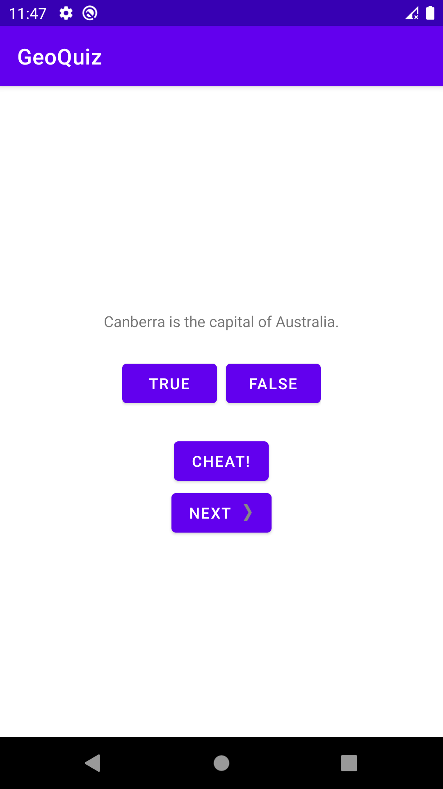

# GeoQuiz

This is the first App from the book ["Android Programming with kotlin"](https://bignerdranch.com/books/) 
by the bignerdranchGuide.

# Description

This App questions the User with basic questions on basic Geography. It
also displays toast messages to inform the user if a question is correct or not.

## ScreenShots

